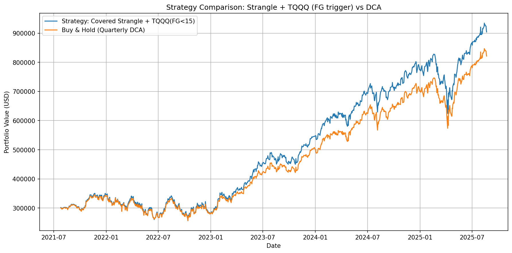
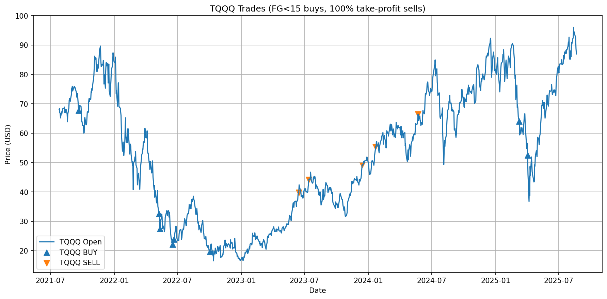
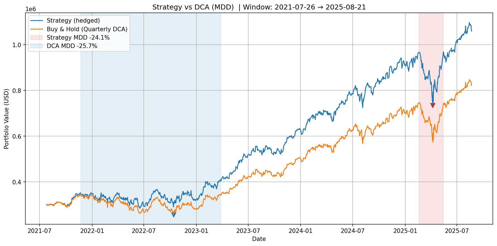
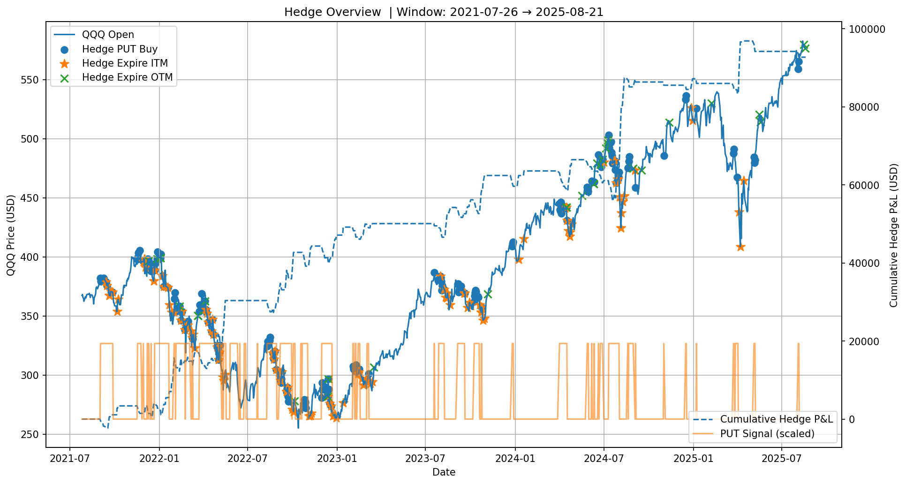

<h1 align="center">Covered Options Backtests (QQQ)</h1>
<p align="center"><em>Layered strategies → clear comparisons → reproducible pipeline</em></p>

<p align="center">
  <a href="https://github.com/yudonglu1136/Covered_Call_Backtest/actions">
    
  </a>
  
  <a href="LICENSE"></a>
</p>

<p align="center">
  <a href="#highlights">Highlights</a> •
  <a href="#strategy-ladder">Strategy ladder</a> •
  <a href="#results-preview">Results</a> •
  <a href="#setup">Setup</a> •
  <a href="#data-pipeline">Data pipeline</a> •
  <a href="#run-backtests">Run backtests</a>
</p>

---

## Highlights
- **Progressive design**: start from covered call and add one feature at a time (CSP → TQQQ overlay → hedge).
- **Deterministic rules**: IV→Δ targeting, 106% strike floor, CSP 1–3 DTE, hedge 28–31 DTE.
- **Reproducible**: a one-shot **pipeline** to fetch/update all datasets and generate signals.
- **Artifacts**: charts, CSVs, logs, and HTML reports saved under `output/**`.

> [!TIP]
> Run the data pipeline before backtesting: python `data_gen/run_pipeline.py`


## Strategy ladder
| Level | Strategy | File | Adds on top of previous |
| :--: | :-- | :-- | :-- |
| 1 | **Covered Call** | `covered_call.py` | Sell CC (15–18 DTE) with IV→Δ target & **106% floor**; DCA & dividends. |
| 2 | **Covered Call Strangle** | `covered_call_strangle.py` | + Cash-secured PUT (1–3 DTE) to (re)build 100-lot; fully collateralized. |
| 3 | **CC Strangle + TQQQ** | `covered_call_strangle_with_TQQQ.py` | + **TQQQ overlay** when **F&G < 15**, integer-share buys, **+100%** TP per batch. |
| 4 | **Hedged Strategy** | `hedged_strategy.py` | + Protective **ATM PUT** (28–31 DTE) on `put_signal == 1`, track hedge P&L. |

> In our runs, **Level 3 (CC Strangle + TQQQ)** often shows the best risk/return trade-off (window-dependent).
> The **hedge version** delivered the best performance, but since it was trained with XGBoost and hasn’t been live-tested, its results on test data are much weaker than on training data, even though the risk-reward ratio still looks decent."

## Results preview
<p align="center">

  
</p>

<p align="center">
  
</p>

## Result Summary
```bash

Backtest Summary (Covered Strangle + TQQQ on FG<15)
----------------------------
Final equity (Strategy):    $929,690.82
Final equity (DCA):         $843,108.50
Total invested capital:     $540,000.00

Total return (Strategy):    72.16%
Total return (DCA):         56.13%
CAGR (Strategy):            14.33%
CAGR (DCA):                 11.61%

Sharpe (Strategy):          1.19
Sharpe (DCA):               1.18

Option premium collected:   $60,369.93
TQQQ realized P&L:          $37,232.11
TQQQ open position:         312 shares

Excess over DCA:            $86,582.32
Excess per year:            $21,338.65
----------------------------

```
## Result Updatad 

```bash

Backtest Summary (Costs ON)  |  Window: 2021-07-26 → 2025-08-21
---------------------------------------------------------------------------
Costs: Commission $0.65/ctr | BUY slip +15% | SELL slip -10%

Final equity (Strategy):    $1,083,869.07
Final equity (DCA):         $838,334.50
Total invested capital:     $540,000.00

Total return (Strategy):    100.72%
Total return (DCA):         55.25%
CAGR (Strategy):            18.68%
CAGR (DCA):                 11.42%
Sharpe (Strategy):          1.33
Sharpe (DCA):               1.17

Max Drawdown (Strategy):    -24.11%  (peak 2025-02-18 → trough 2025-04-07 → rec 2025-05-14)
Max Drawdown (DCA):         -25.69%  (peak 2021-11-22 → trough 2022-10-13 → rec 2023-03-27)

Option premium collected (net):   $43,221.14
TQQQ realized P&L:                $59,163.74
TQQQ open position:               738 shares

Hedge premium paid (after costs): $123,763.10
Hedge payouts received:           $216,448.00
Hedge net P&L:                    $92,684.90
Open hedge count:                 0

```
<p align="center">

  
</p>

<p align="center">
  

</p>


## Setup

### 1) Create your `.env` and add API keys
```bash
cp .env.example .env
# Then open .env and fill in:
# POLYGON_API_KEY=your_polygon_key
# FRED_API_KEY=your_fred_key
# RAPIDAPI_KEY=your_rapidapi_key

```

### 2) Install dependencies (virtualenv recommended)

```bash
python -m venv .venv
# macOS / Linux
source .venv/bin/activate
# Windows (PowerShell)
# .venv\Scripts\Activate.ps1

pip install -r requirements.txt
```

### Data-pipeline

```bash
python data_gen/run_pipeline.py
```

This runs, in order:

```bash
data_gen/update_qqq_options_dataset.py

data_gen/QQQ_TQQQ_update.py

data_gen/generate_put_signals.py

data_gen/fetch_fear_and_greed_index.py #(5 times to fill gaps)

```

### Run-Backtests

```bash
python covered_call.py
```

Outputs will appear under:

- `output/covered_call/` — charts (`strategy_comparison_*.png/pdf`), `equity_curves.csv`, `summary.txt`, `report.html`

- `log/` — detailed run logs