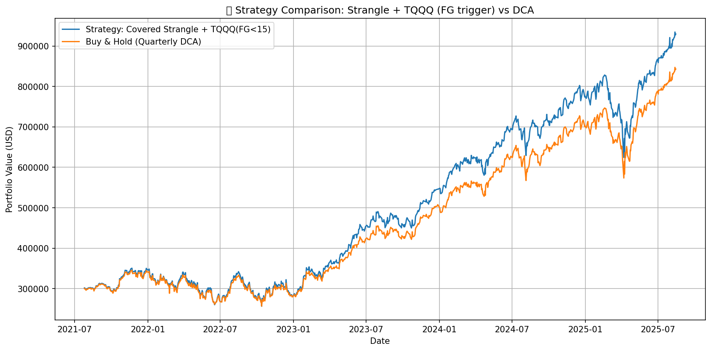

<h1 align="center">Covered Options Backtests (QQQ)</h1>
<p align="center"><em>Layered strategies → clear comparisons → reproducible pipeline</em></p>

<p align="center">
  <a href="https://github.com/yudonglu1136/Covered_Call_Backtest/actions">
    
  </a>
  
  <a href="LICENSE"></a>
</p>

<p align="center">
  <a href="#highlights">Highlights</a> •
  <a href="#strategy-ladder">Strategy ladder</a> •
  <a href="#results-preview">Results</a> •
  <a href="#setup">Setup</a> •
  <a href="#data-pipeline">Data pipeline</a> •
  <a href="#run-backtests">Run backtests</a>
</p>

---

## Highlights
- **Progressive design**: start from covered call and add one feature at a time (CSP → TQQQ overlay → hedge).
- **Deterministic rules**: IV→Δ targeting, 106% strike floor, CSP 1–3 DTE, hedge 28–31 DTE.
- **Reproducible**: a one-shot **pipeline** to fetch/update all datasets and generate signals.
- **Artifacts**: charts, CSVs, logs, and HTML reports saved under `output/**`.

> [!TIP]
> GitHub 的 README 

## Strategy ladder
| Level | Strategy | File | Adds on top of previous |
| :--: | :-- | :-- | :-- |
| 1 | **Covered Call** | `covered_call.py` | Sell CC (15–18 DTE) with IV→Δ target & **106% floor**; DCA & dividends. |
| 2 | **Covered Call Strangle** | `covered_call_strangle.py` | + Cash-secured PUT (1–3 DTE) to (re)build 100-lot; fully collateralized. |
| 3 | **CC Strangle + TQQQ** | `covered_call_strangle_with_TQQQ.py` | + **TQQQ overlay** when **F&G < 15**, integer-share buys, **+100%** TP per batch. |
| 4 | **Hedged Strategy** | `hedged_strategy.py` | + Protective **ATM PUT** (28–31 DTE) on `put_signal == 1`, track hedge P&L. |

> In our runs, **Level 3 (CC Strangle + TQQQ)** often shows the best risk/return trade-off (window-dependent).

## Results preview
<p align="center">

  
</p>

<p align="center">
  
</p>


## Setup

### 1) Install dependencies
```bash
python -m venv .venv
source .venv/bin/activate        # Windows: .venv\Scripts\activate
pip install -r requirements.txt  # pandas, numpy, yfinance, pandas_market_calendars, requests, scipy, matplotlib, python-dotenv, etc.
